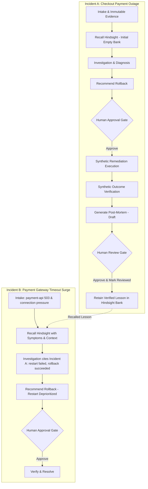

# MemoryOps — AI Incident Response & Engineering Memory Agent

MemoryOps is an incident-response console for SRE and platform engineering teams. It keeps the human operator in the loop while connecting immutable telemetry evidence, institutional memory from prior incidents, simulated remediation, synthetic verification, and reviewed post-mortems.

The demo environment models fictional **Northstar Commerce**. Monitoring telemetry, metrics, and logs are synthetic fixtures, and every remediation action is simulated. MemoryOps never executes shell commands or modifies real production infrastructure.

---

## Architecture

MemoryOps is structured as a pnpm monorepo with clean separation between frontend, backend, and shared libraries:

```
├── artifacts/
│   ├── api-server/         # Express + TypeScript API server
│   │   ├── src/memoryops/  # In-memory store, scenarios, and Hindsight client adapter
│   │   ├── src/routes/     # REST API routes mounted under /api
│   │   └── src/__tests__/  # Unit and integration test suites
│   ├── memoryops/          # React + TypeScript + Vite incident console
│   └── mockup-sandbox/     # Component design and fixture sandbox
├── lib/
│   ├── api-client-react/   # Generated React Query hooks and type-safe client
│   ├── api-spec/           # OpenAPI 3.0 specification (openapi.yaml)
│   └── api-zod/            # Zod validation schemas derived from OpenAPI spec
└── docs/                   # Architecture and Hindsight SDK verification notes
```

- **Frontend**: React 19, TypeScript, Vite, Tailwind CSS, Lucide icons, and TanStack React Query.
- **Backend**: Express 5, TypeScript, Node.js runtime, Pino structured logger.
- **Memory Engine**: Server-side Hindsight memory adapter powered by the official `@vectorize-io/hindsight-client` (v0.10.1) TypeScript SDK.
- **Persistence**: Append-safe JSON document store persisted locally at `.data/memoryops.json`.

---

## Hindsight Integration

The Hindsight adapter (`artifacts/api-server/src/memoryops/hindsight.ts`) sits exclusively on the backend:

1. **Retain**: Invoked only after an incident is resolved, synthetically verified, and its post-mortem has been explicitly human-reviewed. Retains concise, evidence-grounded lessons containing symptoms, root cause, verified remediation, and applicable conditions using idempotent document IDs (`updateMode: "replace"`).
2. **Recall**: Dynamically invoked during the intake of an incident investigation. Assembles query context from the target service, symptom summary, error log signatures, and deployment context.
3. **Reflect**: Synthesizes cross-incident lessons and recurring outcome patterns across the configured bank when an operator submits exploratory queries.

### Honest Fallback and Provenance Labeling

- **When configured and reachable**: The adapter communicates directly with the live Hindsight service. Memories and traces are labeled `Live Hindsight bank (<bank_id>)`.
- **When unconfigured**: The adapter falls back to local storage and explicitly labels memories as `Simulated demo memory — Hindsight unavailable`.
- **When a remote error occurs**: Network errors or timeouts are caught safely without crashing. Memories are labeled `Simulated demo memory — Hindsight recall failed: <error>`, and the failure is never converted into a false live success.

---

## The Incident Learning Loop



### Strict Human Gates Enforced in Code
- **Remediation Approval Gate**: Approval and execution are distinct steps. Synthetic remediation does not execute without explicit operator decision. Execution is not verification (`execution !== verification`).
- **Post-Mortem Review Gate**: Post-mortems are generated in `draft` status upon verification. Calling `POST /api/incidents/:id/postmortem/retain` before human review is strictly rejected with `409 Conflict`.
- **Explicit Review Action**: Editing post-mortem text (`PUT /api/incidents/:id/postmortem`) saves drafts and preserves `draft` status. It is **never** auto-promoted to reviewed. The operator must explicitly invoke the review action (`POST /api/incidents/:id/postmortem/review`) before retention is permitted.
- **Preconditions Required Before Retention**:
  1. Incident exists in store.
  2. Synthetic execution exists (`incident.synthetic_execution`).
  3. Synthetic verification passed (`incident.synthetic_verification.passed === true`).
  4. Incident is in resolved state (`status === "resolved"`).
  5. Post-mortem exists.
  6. Post-mortem review status is explicitly `"reviewed"`.
- **Idempotency**: Repeated retention requests return the existing retained memory ID without duplicate writes.

---

## Local Development & Setup

### Prerequisites
- Node.js v20+ or v24
- pnpm (v9+ or v12+)
- Git

### Installation
```bash
git clone https://github.com/sasaankteku-blip/MemoryOps-AI-Incident-Agent.git
cd MemoryOps-AI-Incident-Agent
pnpm install
```

### Running Locally
Run the Express API server and Vite frontend in separate terminal sessions:

```bash
# Terminal 1: Start API server (port 3000)
pnpm --filter @workspace/api-server run dev

# Terminal 2: Start Frontend console (port 5173, proxies /api to port 3000)
pnpm --filter @workspace/memoryops run dev
```

Open **[http://localhost:5173/](http://localhost:5173/)** in your browser.

---

## Running Automated Checks

All tests, typechecks, formatting checks, and builds use standard project scripts:

```bash
# Run unit, integration, and HTTP lifecycle test suite (35 tests across 12 suites)
pnpm test

# Run TypeScript typechecks across all libraries and applications
pnpm run typecheck

# Check Prettier code formatting on changed files
pnpm prettier --check artifacts/api-server/src/memoryops/hindsight.ts artifacts/api-server/src/memoryops/store.ts artifacts/api-server/src/routes/memoryops.ts

# Build production bundles for API server and frontend
pnpm run build

# Check for Git whitespace or formatting issues
git diff --check

# Run dedicated live Hindsight verification tool (runs live if credentials provided)
pnpm --filter @workspace/api-server run verify-hindsight
```

---

## Environment Configuration

Copy the template to create a local `.env` file:
```bash
cp .env.example .env
```

> **Security Rule**: Never commit `.env` or credentials to Git. Local `.env` files are ignored in `.gitignore`.

| Variable Name | Required | Purpose | Safe Example Value |
|---|---|---|---|
| `PORT` | Yes (backend) | Listening port for the Express API server | `3000` |
| `HINDSIGHT_BASE_URL` | Optional | URL of Hindsight Cloud or self-hosted deployment | `https://api.hindsight.vectorize.io` |
| `HINDSIGHT_API_KEY` | Optional | Bearer API token for authenticated Hindsight banks | `sec_abc123...` |
| `HINDSIGHT_BANK_ID` | Optional | Bank namespace for incident lessons (defaults to `memoryops-demo-northstar`) | `memoryops-demo-northstar` |
| `GROQ_API_KEY` | Optional | API key for LLM structured output synthesis | `gsk_...` |
| `LLM_MODEL` | Optional | Model identifier for LLM synthesis | `llama-3.3-70b-versatile` |
| `MEMORYOPS_STATE_FILE` | Optional | Path to local JSON document store | `.data/memoryops.json` |
| `APP_ENV` | Optional | Application runtime environment | `development` |
| `GITHUB_TOKEN` | Optional | GitHub token (disabled by default) | `ghp_...` |

---

## Persistence & Boundary Limitations

- **State File**: Local state is persisted to `.data/memoryops.json` (or `MEMORYOPS_STATE_FILE`).
- **Data Saved**: Incidents, immutable evidence items, investigation runs, post-mortems, locally cached memories, and retention operations log.
- **Limitations**: The single-file JSON store is designed for local development, demos, and reproducible test runs. It does not provide distributed locks across multiple API processes.

---

## Endpoints Reference

- **Health Check**: `GET /api/healthz`
  - Returns `{"status":"ok","version":"0.1.0","db":"ok"}` with HTTP 200.
- **Integration Status**: `GET /api/integrations/status`
  - Truthfully reports connectivity and reachability for Hindsight, LLM, and GitHub.
  - Distinguishes 4 Hindsight states: `connected real hindsight`, `simulated fallback`, `not configured`, and `remote service error`.
- **Dashboard**:
  - `GET /api/dashboard`: Summary statistics and incident counts.
- **Incidents**:
  - `GET /api/incidents`: List incidents with status and severity filters.
  - `POST /api/incidents`: Create a custom incident with evidence-first schema.
  - `POST /api/incidents/:id/investigate`: Launch incident investigation and recall memories.
  - `GET /api/incidents/:id/investigation`: Retrieve investigation run details.
  - `POST /api/incidents/:id/approve-remediation`: Human approval for simulated remediation.
  - `POST /api/incidents/:id/verify`: Verify simulated outcome against scenario criteria.
  - `PUT /api/incidents/:id/postmortem`: Save post-mortem draft edits without auto-approving.
  - `POST /api/incidents/:id/postmortem/review`: Explicit human sign-off marking post-mortem as reviewed.
  - `POST /api/incidents/:id/postmortem/retain`: Retain verified, reviewed lesson into Hindsight (rejected with 409 if draft or unverified).
- **Memories**:
  - `GET /api/memories`: Query retained memories across services.
  - `POST /api/memories/reflect`: Ask Hindsight to reflect and synthesize cross-incident patterns.
- **Demo Management**:
  - `GET /api/demo/scenarios`: List built-in Northstar scenarios.
  - `POST /api/demo/load`: Load demo fixtures idempotently.
  - `POST /api/demo/reset`: Reset environment back to pristine starter state.

---

## Step-by-Step Demo Walkthrough

1. Open **Command center** (`/incidents`) and select **INC-2025-0117** (Payment pool exhaustion on `payment-api`).
2. Click **Investigate**. Notice that the initial bank has no prior memory for this signature.
3. Review the proposal: the agent recommends **Rollback d-4821** based on connection pool exhaustion.
4. Click **Approve remediation** to simulate execution.
5. Click **Run verification**. The synthetic check passes, and the incident moves to `resolved`.
6. Open **Post-mortems** (`/postmortems`). Select the resolved incident.
7. Notice the amber badge: `Review status: draft (review required)`. Notice the "Retain in memory" button is locked.
8. Edit notes if desired and click **Save draft** (status remains `draft`).
9. Click **Approve & Mark Reviewed** (status transitions to emerald `reviewed`).
10. Click **Retain in memory**. The verified lesson is stored into the memory bank.
11. Open **INC-2025-0164** (Payment gateway timeout surge on `payment-api`) and start investigation.
12. In the **Hindsight** tab and **Reasoning** tab, observe that Incident B has recalled Incident A's verified post-mortem.
13. Inspect the recommendation: restart is intentionally deprioritized because Incident A proved it fails to hold, recommending a safe rollback instead.
14. Open **Settings** (`/settings`) to inspect integration health.

---

## Verification & Status Summary

| Area | Status | Notes |
|---|---|---|
| **Hindsight Client Adapter** | Verified with automated tests | Uses `@vectorize-io/hindsight-client` v0.10.1 with retain, recall, reflect, and getVersion. |
| **Verification & Approval Lifecycle** | Verified with automated tests | Execution $\neq$ verification. Synthetic checks require fixture match. |
| **Post-Mortem Review Gate** | Enforced & verified | Unreviewed or unverified post-mortems cannot be retained (409 Conflict). |
| **Incident A $\rightarrow$ Incident B Learning Loop** | Verified with automated tests | Incident B recalls Incident A from bank and deprioritizes restart. |
| **Test Suite** | 35/35 passing | Comprehensive suite across 12 test groups in `artifacts/api-server/src/__tests__/`. |
| **Type Checking & Build** | Clean (0 errors) | `pnpm run typecheck` and `pnpm run build` pass across all workspace packages. |
| **Live Remote Bank Round Trip** | Ready for credentials | Without live credentials, the app runs in truthful simulated fallback mode. When `HINDSIGHT_BASE_URL` is set, `pnpm run verify-hindsight` runs 100% live. |