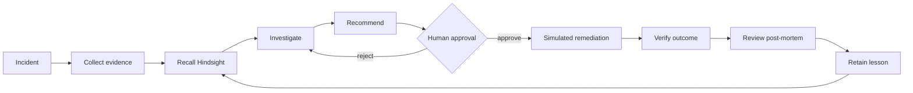

# MemoryOps

MemoryOps is an incident-response console for SRE and platform engineers. It
keeps the operator in the loop while connecting incident evidence, prior
engineering experience, simulated remediation, verification, and reviewed
post-mortems.

The demo environment is fictional **Northstar Commerce**. Monitoring records
are synthetic fixtures and every remediation is simulated. The app never runs a
shell command, deployment, or infrastructure change.

## The workflow



The central product idea is that a verified historical outcome changes a later
investigation. Incident A teaches that a restart only improved payment health
temporarily while rollback restored it. Incident B recalls that memory, shows
overlap and differences, and deprioritizes restart instead of asserting the
same root cause.

## Hindsight's role

The Hindsight adapter is the intended authoritative memory boundary:

- **Retain**: after a verified resolution and human-reviewed post-mortem.
- **Recall**: during investigation, using service, symptoms, and salient
  evidence.
- **Reflect**: when multiple memories are available or an operator asks a
  cross-incident question.

The current runnable preview is explicit about its limitation: no Hindsight or
Groq credentials are installed in this environment, so the demo uses an
append-safe simulated memory store and labels every memory source as
`Simulated demo memory — Hindsight unavailable`. It does not claim a live
Hindsight success. See `docs/hindsight-verification.md` for the verified SDK
findings and the remaining live-adapter work.

## Run

The project uses the Replit workspace with a frontend artifact and a shared API
artifact:

```bash
pnpm install
pnpm --filter @workspace/api-server run dev
pnpm --filter @workspace/memoryops run dev
```

The managed workflows provide `PORT` and the preview routing. The API is
available at `/api`; the frontend is served at `/`.

The backend persists the demo store at `.data/memoryops.json` by default. This
is intentionally lightweight for the preview; the next hardening pass can
replace the store with the SQLite/SQLAlchemy schema described in
`docs/design-notes.md`.

## Demo walkthrough

1. Open Command center and select the active payment incident.
2. Start the investigation. The first payment incident has no prior memory.
3. Review fixture evidence and the rollback proposal.
4. Approve the simulation and confirm the verification passes without touching
   infrastructure.
5. Open Post-mortems, review/edit the record, then retain it.
6. Open the second payment incident. Its investigation now recalls Incident A
   and carries forward the failed restart outcome.
7. Open Memory explorer and the Memory trace to inspect the persisted path.
8. Use Demo lab to load fixtures again or reset only the simulated demo data.

## API and testing

The API contract lives in `lib/api-spec/openapi.yaml`; generated React Query
hooks and Zod schemas are refreshed with:

```bash
pnpm --filter @workspace/api-spec run codegen
pnpm run typecheck
```

The verified smoke path covers health, dashboard, incident listing, the
investigation gate, approval, simulated verification, post-mortem retention,
memory recall, and memory trace. The frontend includes loading, empty, error,
and success states on each page.

## Safety and limitations

- Human approval is required before the simulator executes.
- The simulator reads fixture outcomes only and writes application state.
- No real monitoring, cloud, Kubernetes, Jira, Slack, or GitHub integration is
  claimed. GitHub is optional and off by default.
- Live Hindsight round trips and Groq output generation remain disabled until
  their SDK dependencies and credentials are verified in this project.
- LangGraph, SQLite/SQLAlchemy persistence, and live provider adapters are
  documented next-step hardening work; the preview is kept runnable with the
  existing Replit Node workspace and a JSON persistence boundary.